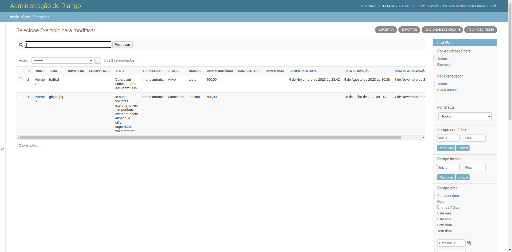
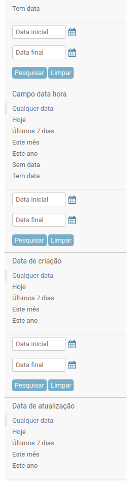
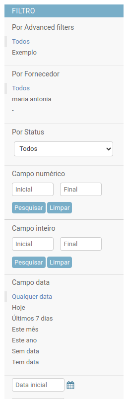
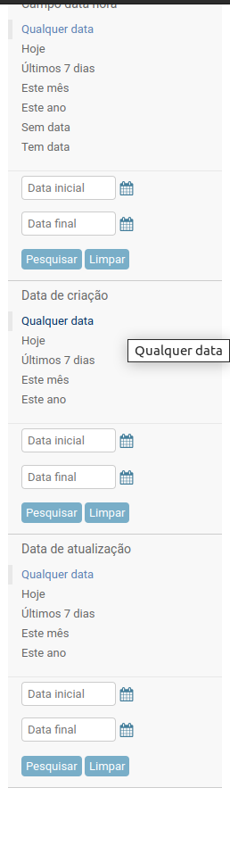

==================
NovadataModelAdmin
==================

Classe para facilitar a criação de um ModelAdmin, implmentando diversas funcionalidades, como:
list_display, search_fields, list_filter, autocomplete_fields, list_select_related, filter_horizontal
exclude e advanced_filter_fields, todos automáticos.

O pacote considera o tipo dos campos e mapeia automaticamente os mesmos para suas respectivas propriedades.
Você pode encontrar a lista de mapeamento `neste <https://github.com/TimeNovaData/novadata_utils/blob/master/novadata_utils/functions/props_dict.py>`_ arquivo do repositório.

Além disso, ele atua em conjunto com outros pacotes, implementando algumas funcionalidades importates.

Exemplo:
=======

.. code-block:: python

  from django.contrib import admin
  from novadata_utils.admin import NovadataModelAdmin

  from ..models import Exemplo

  @admin.register(Exemplo)
  class ExemploAdmin(NovadataModelAdmin):
      ...

Saída:
======

