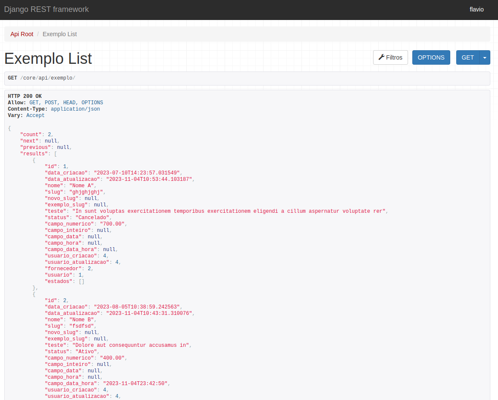
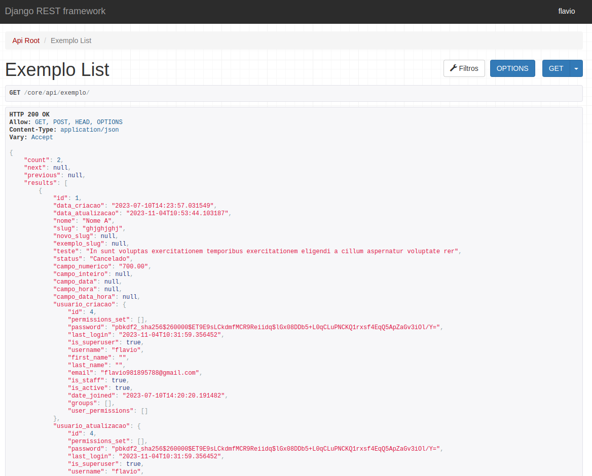

=======================
NovadataModelSerializer
=======================

Classe que traz a serialização de todos os seus objetos necessários para o front-end.

Exemplo básico:
==========

A seguir, um simples exemplo de como usar a classe ``NovadataModelSerializer``:

Código da classe:
-----------------

.. code-block:: python

  from core.models import Exemplo
  from novadata_utils.serializers import NovadataModelSerializer

  class ExemploSerializer(NovadataModelSerializer):
      class Meta:
          """Sub classe para definir meta atributos da classe principal."""

          model = Exemplo

          fields = "__all__"

Saída:
------

representation_fields:
======================

Para facilitar a representação de alguns objetos com sub níveis, foi
criado um atributo chamado ``representation_fields``, que adiciona
os campos desejados no retorno da função nativa do ``Django Rest Framework``
chamada ``to_representation_fields``. Veja abaixo a sintaxe esperada:

Código da classe:
-----------------

.. code-block:: python

  from core.models import Exemplo
  from novadata_utils.serializers import NovadataModelSerializer

  from .fornecedor_serializer import FornecedorSerializer
  from .usuario_serializer import UsuarioSerializer

  class ExemploSerializer(NovadataModelSerializer):
      representation_fields = [
          ("fornecedor", FornecedorSerializer),
          ("usuario_criacao", UsuarioSerializer),
          ("usuario_atualizacao", UsuarioSerializer),
      ]

      class Meta:
          """Sub classe para definir meta atributos da classe principal."""

          model = Exemplo
          fields = "__all__"
          read_only_fields = ["usuario_criacao", "usuario_atualizacao"]

Saída:
------

fields:
=======

Nem sempre desejamos todos os atributos de um objeto, por isso, caso seja
passado um parâmetro get chamado ``fields``, automaticamente a super classe
irá usá-lo para definir quais campos serão incluídos na serialização.
Veja abaixo alguns exemplos:

Url:
----

.. code-block:: console

  http://localhost:8000/core/api/exemplo/?fields=id,nome

Saída:
------

.. figure:: ../assets/images/example_novadata_model_serializer3.png
